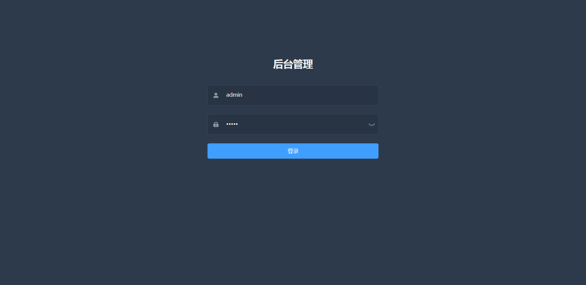
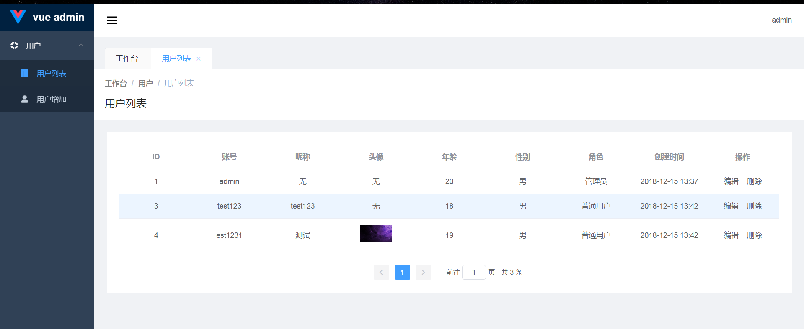
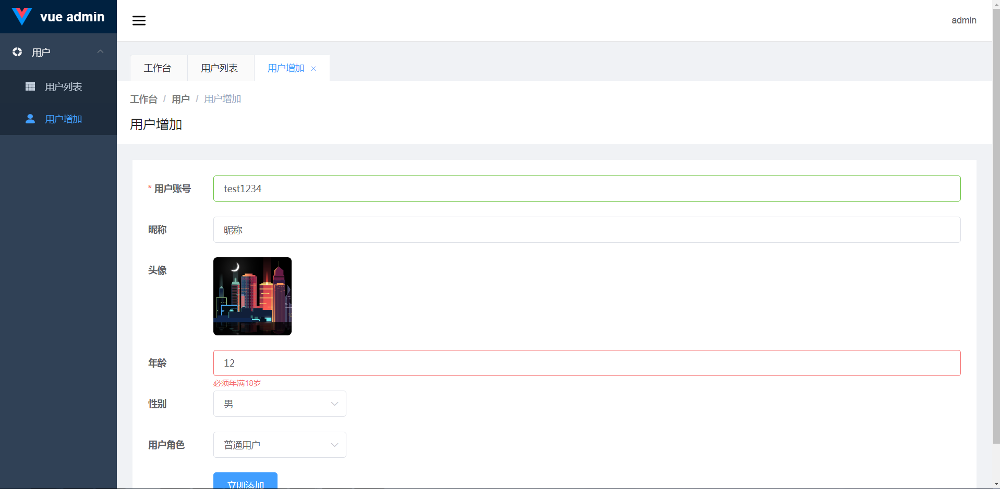

## 这是一个基于[vue-element-admin](https://github.com/PanJiaChen/vue-element-admin)的一个demo

### 主要的技术栈为: vue + vue-router + vuex + element-ui + axios;

## 项目运行

1. 分别在client和server根目录下安装依赖,若node-sass安装失败，先执行 ``` npm config set sass-binary-site http://npm.taobao.org/mirrors/node-sass ```，再安装依赖。

2. 后台使用的技术栈为 thinkjs + mysql，所以还需要安装mysql数据库并打开mysql服务，并将server/test/sql.sql的数据表结构导入数据库。

3. thinkjs连接mysql的配置, server/src/config/adapter.js中的mysql字段,
```node
{
  handle: mysql, // 无需修改
  database: 'end', // 无需修改,database名称
  prefix: 'think_', // 无需修改,表名的前缀
  encoding: 'utf8', // 无需修改,数据库编码
  host: '127.0.0.1', // 无需修改,数据库地址
  port: '', // 无需修改,数据库端口，默认3306
  user: 'root', // 数据库用户名
  password: '', // 数据库密码
  dateStrings: true
},
```

4. 在server根目录下运行 npm start, 在client根目录下运行npm run dev;即可在浏览器进行项目预览。

## 项目运行图





